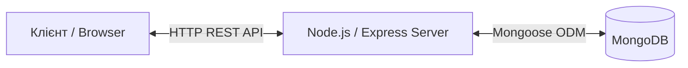

# Beats Coffee - Вебсистема онлайн-замовлень

Повноцінний Full-Stack вебзастосунок (SPA) для автоматизації процесів замовлення кави та десертів. Проєкт містить клієнтську вітрину для відвідувачів та захищену панель керування для персоналу (бариста/адміністратора).

## Архітектурні рішення та Технології

Проєкт побудовано за монорепозиторною структурою (Frontend та Backend в одному репозиторії) з використанням **MERN стеку**:

*   **Frontend:** React.js, Tailwind CSS v4, Lucide React (іконки).
*   **Backend:** Node.js, Express.js.
*   **Database:** MongoDB, Mongoose (ODM).
*   **Security:** JWT (JSON Web Tokens), bcryptjs (хешування паролів).

**Діаграма архітектури:**

## Інструкція для розробників (Локальний запуск)

Для запуску проєкту на вашому комп'ютері повинні бути встановлені Node.js та MongoDB (локально або кластер Atlas).

1. Клонування репозиторію

* git clone https://github.com/ВАШ_ЛОГІН/Coffee-shop-app.git
* cd Coffee-shop-app

2. Налаштування Backend-частини

Перейдіть у папку сервера та встановіть залежності:

* cd backend
* npm install

Створіть файл .env у корені папки backend та додайте наступні змінні середовища:

* PORT=5000
* MONGO_URI=mongodb://localhost:27017/coffee_shop
* JWT_SECRET=your_super_secret_key_here

Запустіть сервер (у режимі розробки з nodemon):

* npm run dev

(Опціонально) Щоб наповнити порожню базу даних початковим меню, виконайте:

* node seed.js

3. Налаштування Frontend-частини

Відкрийте новий термінал, перейдіть у папку клієнта та встановіть залежності:

* cd frontend
* npm install

Запустіть клієнтський застосунок:

* npm run dev
* Відкрийте у браузері: http://localhost:5173/

# Документація API (Backend Endpoints)

Усі запити до API здійснюються за базовою адресою: http://localhost:5000/api

## Продукти (Меню)

* **GET** /products — Отримати весь список доступних товарів. (Публічний)
* **POST** /products — Додати новий товар. (Потребує JWT токен адміна)

## Замовлення (Orders)

* **POST** /orders — Створити нове замовлення. (Публічний).
Тіло запиту (Body):
{
  "customerName": "Олександр",
  "phone": "+380501234567",
  "pickupTime": "14:30",
  "items": [
    { "productName": "Еспресо", "price": 40, "quantity": 2 }
  ]
}
* **GET** /orders — Отримати всі замовлення. (Потребує JWT)
* **PATCH** /orders/:id/status — Змінити статус замовлення. (Потребує JWT)
Приклад тіла запиту (JSON):
{
  "status": "Готується"
}
## Авторизація (Auth)
* **POST** /auth/register — Реєстрація нового адміністратора.
* **POST** /auth/login — Вхід у систему. Повертає JWT токен.
